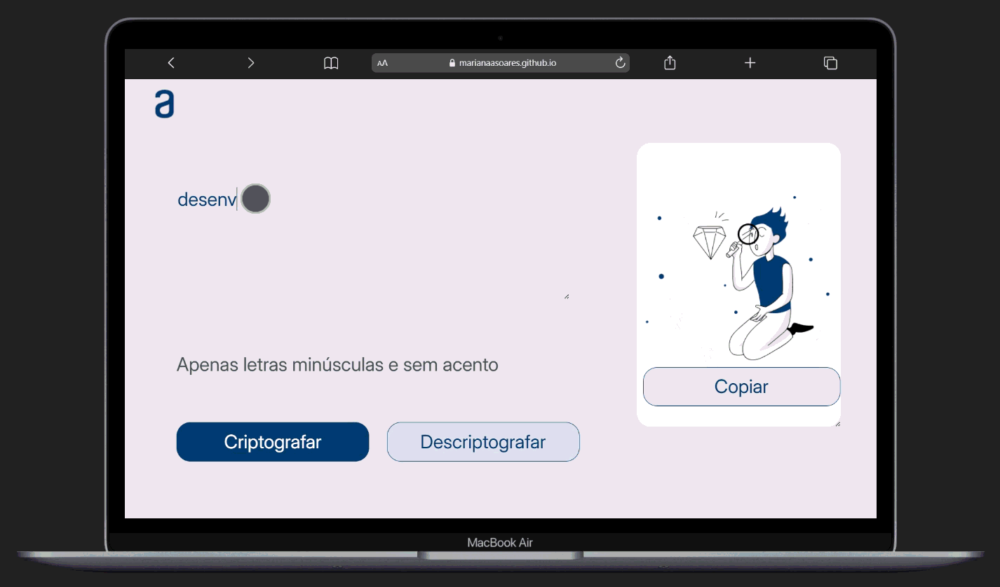

# :closed_lock_with_key: Decodificador de Texto

<p>O Decodificador de Texto permite que o usuário digite uma mensagem e escolha entre criptografar ou descriptografar o conteúdo. </p>

<p>A criptografia funciona através da substituição de determinadas letras por sequências específicas, criando uma nova mensagem codificada. Já a descriptografia realiza o processo inverso, restaurando o texto original.</p>

<p>Além disso, o sistema conta com um botão para copiar o texto gerado, facilitando novas conversões ou o compartilhamento da mensagem.</p>

<p>Aplicação web desenvolvida durante meus estudos na formação da Alura.</p>

🔗 Deploy: https://marianaasoares.github.io/challenge-decodificador-de-texto/

📁 Repositório: https://github.com/MarianaASoares/challenge-decodificador-de-texto

---

# :gear: Regras de Criptografia

| Letra | Conversão |
|------ |-----------|
| a     |    ai     |
| e     |    enter  |
| i     |    imes   |
| o     |    ober   |
| u     |    ufat   |

### Exemplo:

```
Texto original:
ola

Texto criptografado:
oberlai
```


---
# :rocket: Tecnologias Utilizadas

  

---

# :dart: Objetivo do Projeto

<p>Este desafio teve como objetivo praticar conceitos importantes do desenvolvimento front-end, como:</p>

<ul>
  <li>Lógica de programação</li>
  <li>Manipulação do DOM</li>
  <li>Interação com o usuário</li>
  <li>Estruturação de interfaces web</li>
</ul>


---

# :camera: Preview


 
  
🔗 [Ver projeto](https://marianaasoares.github.io/challenge-decodificador-de-texto/) 


---

# :game_die:Funcionalidades

<p>:heavy_check_mark: Criptografia de textos digitados pelo usuário.</p>
<p>:heavy_check_mark: Descriptografia de mensagens codificadas.</p>
<p>:heavy_check_mark: Botão para copiar o conteúdo gerado.</p>
<p>:heavy_check_mark: Interface interativa com alteração visual ao processar mensagens.</p>
<p>:heavy_check_mark: Validação de texto (apenas letras minúsculas e sem acento).</p>

--- 

# :file_folder: Como executar o Projeto

```bash
git clone https://marianaasoares.github.io/challenge-decodificador-de-texto/.git

cd challenge-decodificador-de-texto
```

<p>Depois, basta abrir o index.html no navegador.</p>


